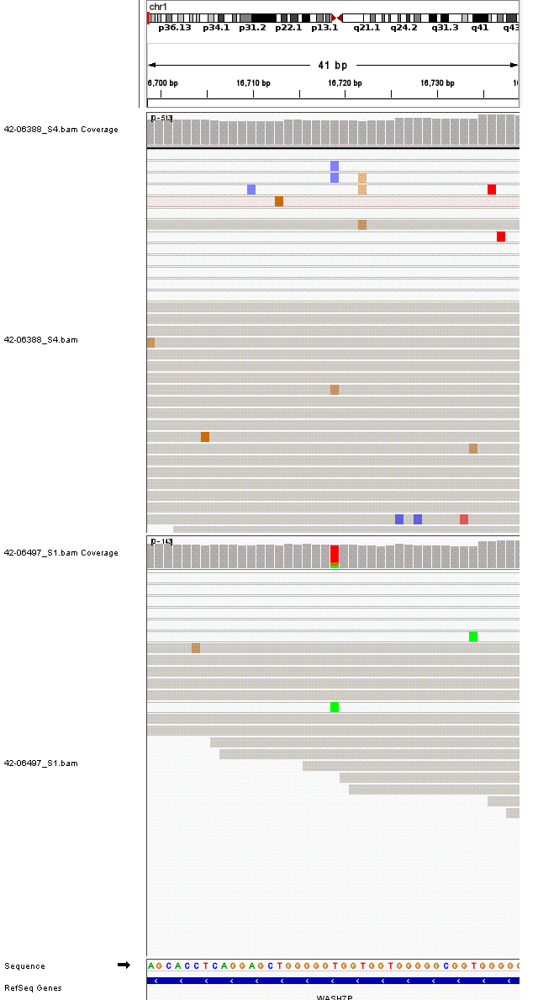

# ShootIGV: IGV snapshot automator wrapper

### Preface

This tool is a wrapper that uses scripts from [IGV-snapshot-automator by stevekm](https://github.com/stevekm/IGV-snapshot-automator) that are made into a singularity image.

### Install

1. Install [isabl-cli](https://github.com/shahcompbio/isabl_cli)
2. Install click by e.g. `pip install click` in your environment

### Run shoot_igv.py

shoot_igv.py takes in the following options:

```
shoot_igv.py --help
Usage: shoot_igv.py [OPTIONS]

Options:
  --isabl_sample_id TEXT  Isabl sample__identifier  [required]
  --region TEXT           chr:start-end  [required]
  --outdir TEXT           IGV screenshot output dir  [default: .; required]
  --match_normal          Find and match normal sample  [default: True]
  --n_flanking INTEGER    Flanking base-pairs around input region  [default:
                          20]
  --verbose               Show inner variables for debugging
  --help                  Show this message and exit.
```

One example of this would be the following, which is equivalent of the `test/run.sh` script.
```
cd test # test directory of the repo
../shoot_igv.py --isabl_sample_id ADT001 --region chr1:16719-16719 --outdir snapshots &> run.log
```

The resulting output is a png file with `${TUMOR_ISABL_SAMPLE_ID}_${NORMAL_ISABL_SAMPLE_ID}_chr${CHROMOSOME}_(( ${START_POSITION} - ${OFFSET} ))_(( ${END_POSITION} + ${OFFSET} )).png`.

For example, the path for test output is: `test/snapshots/ADT001_ADG001_chr1_16699_16739.png` for `--isabl_sample_id ADT001` and `--region chr1:16719-16719`, with default offset of 20 bp.

